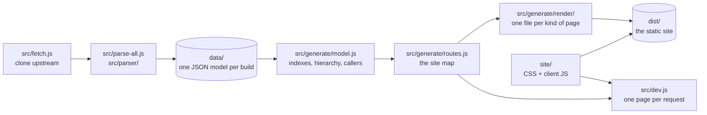

# Contributing

Thanks for looking. This is a static site generator with no runtime
dependencies: Node 20+, ES modules, and nothing to install. The point of this
page is to get you from "I want to change that" to the file that says it.

If you only want to add documentation to a DayZ declaration, you do not need
any of this — see [Community notes](README.md#community-notes), which is one
JSON file.

## Getting it running

```sh
npm run fetch   # clone/update the upstream sources, detect builds
npm run parse   # parse them into data/model-<build>.json (cached by commit sha)
npm run dev     # http://localhost:3000 — renders on demand, reloads on save
npm test
```

`npm run dev` is the inner loop, and it never touches `dist/`. It loads the
newest build's model once and renders whichever page you open, in a few
milliseconds each; older builds render the same way at `/v/<label>/`. CSS and
client JavaScript are served straight out of `site/`, so a save is a refresh.

`npm run generate` writes the whole site into `dist/`, which is what Netlify
runs. You rarely need it while working; `npm run generate:latest` does only the
newest build if you do.

## The pipeline



`src/generate/routes.js` is the single site map. The generator walks it to
write every page; the dev server looks one page up in it by URL. Neither can
drift from the other, because there is only the one list.

## Where is the HTML?

There are no `.html` files. Every page is a JavaScript function returning a
template literal, one file per kind of page. The fastest way to find the one
you want is to open the page under `npm run dev` and view source: line two
names the file.

| URL | File |
| --- | --- |
| `/` | `src/generate/render/home.js` |
| `/topics/`, `/topics/<Name>/` | `src/generate/render/topics.js` |
| `/classes/`, `/classes/index/`, `/classes/<letter>/`, `/classes/members/…` | `src/generate/render/classes.js` |
| `/classes/<Name>/`, `/classes/<Name>/members/` | `src/generate/render/class.js` |
| `/enum/<Name>/`, `/globals/…` | `src/generate/render/globals.js` |
| `/files/`, `/files/<Dir>/<Name.c>/` | `src/generate/render/files.js` |
| `/classes/hierarchy/` | `src/generate/render/hierarchy.js` |
| `/changelog/` | `src/generate/render/changelog.js` |
| `/community/` | `src/generate/render/community.js` |
| `/about/` | `src/generate/render/about.js` |
| 404 | `src/generate/render/notfound.js` |

Everything around a page body — `<head>`, the header, the nav bar, the search
palette — is `layout()` in `src/generate/html.js`, which is also
where signatures and doc comments are rendered. The pieces more than one page
needs (source links, "Referenced by") are in `src/generate/render/shared.js`.
`src/generate/render.js` is a barrel that re-exports the lot, so importers
need not know which file a renderer is in.

Everything that acts on the page you are already on — the filter field, the
A–Z, expand and collapse, the tabs to a page's siblings — is one bar under
the site nav, built by `pageBar()` in `src/generate/render/pagebar.js`. A page
asks for the parts it wants and passes the result to `layout()` as `bar`,
which hangs it below the header, outside `<main>`, so it spans the window.
A new control goes in that one file rather than in each renderer that wants
it. Being outside the body, it travels with an archived page in the meta line
rather than in the stored body; see `ARCHIVE_MARK` in `src/generate/html.js`.

HTML-bearing template literals are prefixed with `/* html */`. It costs
nothing at runtime, and editors with the common
[es6-string-html](https://marketplace.visualstudio.com/items?itemName=Tobermory.es6-string-html)
extension will syntax-highlight and format the markup inside them.

Hand-written prose that is not derived from a build — the homepage blurbs, the
community links, the about page, the release threads — is in `src/generate/content.js`.

## Where is the behaviour?

`site/app.js` is a list of feature inits, one line each. Every feature is a
module beside it in `site/app/`, and each is guarded by whether the thing it
works on is on the page, which is how one script serves ~660,000 pages.

| Feature | File |
| --- | --- |
| Light/dark, the wordmark | `site/app/theme.js` |
| The nav bar | `site/app/nav.js` |
| Which build this is, the version switcher | `site/app/builds.js` |
| The search palette | `site/app/search.js` |
| `search.json`, shared by four features | `site/app/search-index.js` |
| Recent & pinned pages | `site/app/recent.js` |
| The `?` shortcuts list | `site/app/shortcuts.js` |
| Enforce Script highlighting | `site/app/highlight.js` |
| A source page: links, folding | `site/app/source.js` |
| "Added in" badges, the History timeline | `site/app/history.js` |
| Community notes | `site/app/notes.js` |
| What a signature keyword means, on hover | `site/app/glossary.js` |
| Copy buttons, the override stub | `site/app/copy.js` |
| "Copy for LLM" on a class or enum | `site/app/llm.js` |
| The page bar under the nav | `site/app/pagebar.js` |
| Arrow keys on the files tree | `site/app/tree.js` |
| The member and field tables | `site/app/members.js` |
| Table of contents | `site/app/toc.js` |
| The source minimap | `site/app/minimap.js` |
| The changelog, loaded on demand | `site/compare.js` |

Four modules are not features: `site/app/dom.js` is the handful of helpers
and the page facts everything reads off `<body>`, `site/app/search-index.js`
loads `search.json` once for whoever asks, `site/app/overlay.js` keeps two
overlays from being open at the same time, and `site/app/pill.js` is the
travelling highlight the rail and the version switcher both light their rows
with.

Styles are one file, `site/styles.css`. `site/notfound.js` and
`site/archive.js` are separate entry points, loaded only by the 404 page and
the archive shell.

`site/app.js` is loaded as `<script type="module">`, so `site/app/` has to
reach the browser as a directory: the generator copies `site/` recursively into
`dist/assets/`, and the dev server serves subpaths under `/assets/`.

## The parser

`src/parser/` reads Enforce Script — a preprocessor pass, a lexer, and a
recursive-descent pass that produces the per-file model. It is documented in
the files that implement it, and `test/parser.test.js` is the specification in
practice. After changing it, re-run with `FORCE_PARSE=1 npm run parse` (or
`ONLY_VERSION=1.29` for one build) so the commit-sha cache is not reused.

## Conventions

**No runtime dependencies.** Node's standard library only, in both the
generator and the browser. There is no bundler and no build step for the
client: `site/` is copied to `dist/assets/` as it is.

**Node 20+, ES modules.** In `src/`, in `site/`, and in `test/`.

**A page's bytes must depend only on its content.** Not on which build
rendered it, not on the date, not on the state of the rest of the site map.
That is what lets `dist/` hard-link identical pages across ~49 builds instead
of storing each one again, and it is why the build number, the topic list and
the "added in" badges are all fetched by the client rather than written into
the HTML. `test/render.test.js` guards it; if you find yourself wanting to put
a version number on a page, read the comment on `layout()` first.

**Everything a page can compute, it computes.** The all-members table, the
data-fields index and the source page's cross-links are all built in the
browser from `search.json`, which the page fetches for the search palette
anyway. Inlining the all-members table alone costs 564 MB per build.

## Tests

`npm test` runs `node --test` over `test/`. There is no framework and no
config. Worth knowing about:

- `test/render.test.js` — the byte-identity invariant above
- `test/routes.test.js` — every page is reachable by URL, and no two claim one
- `test/app.test.js` — runs the whole client against a DOM where nothing is
  found, which is the only way most of it is exercised at all
- `test/parser.test.js` — the Enforce Script grammar, by example

## Pull requests

Small and focused is easiest to review. Say what changed and why; if it is a
rendering change, a before/after screenshot helps. Run `npm test` first.

Bugs and questions: [Discord](https://discord.yadz.app/), or open an
issue.
